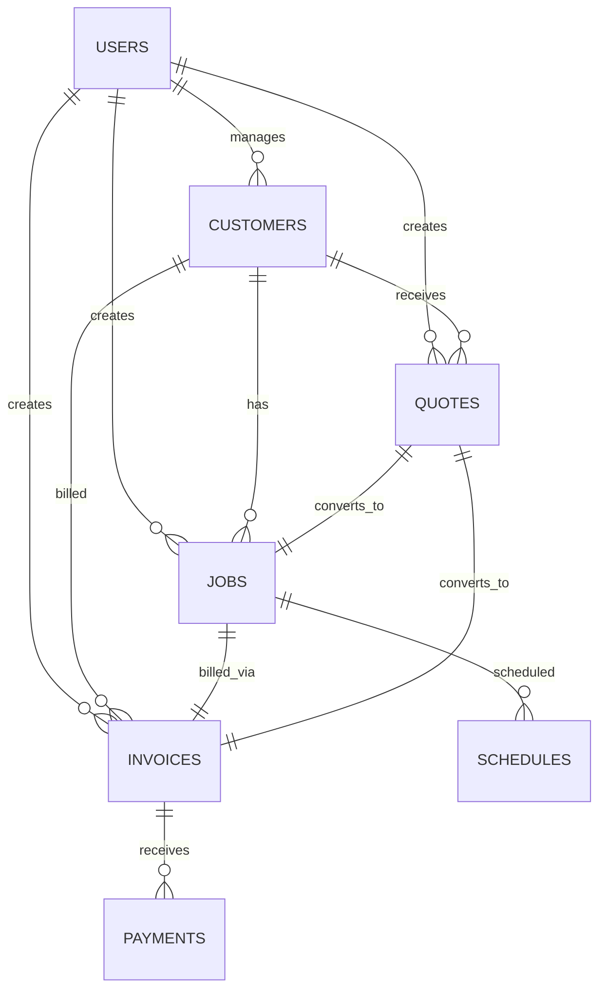
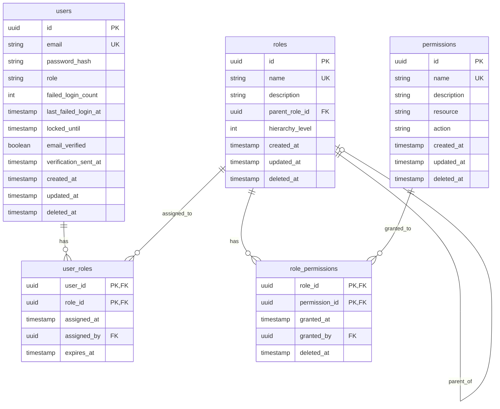
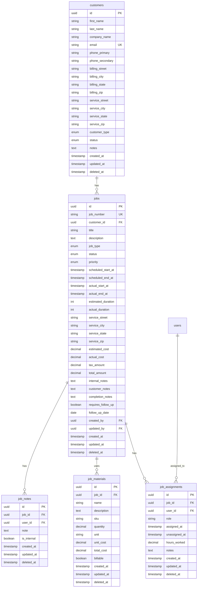
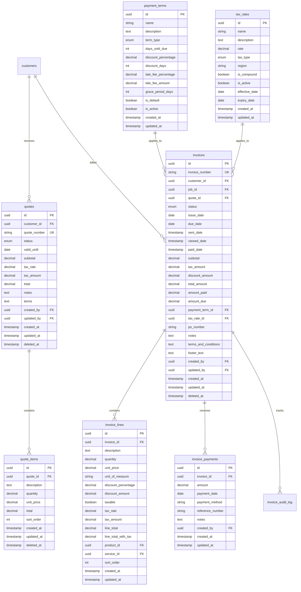
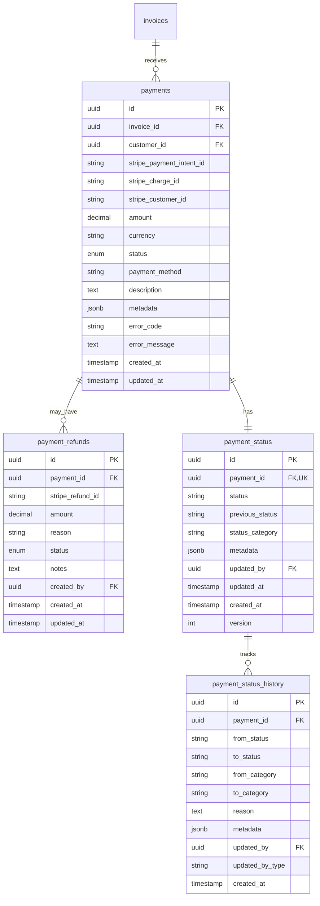
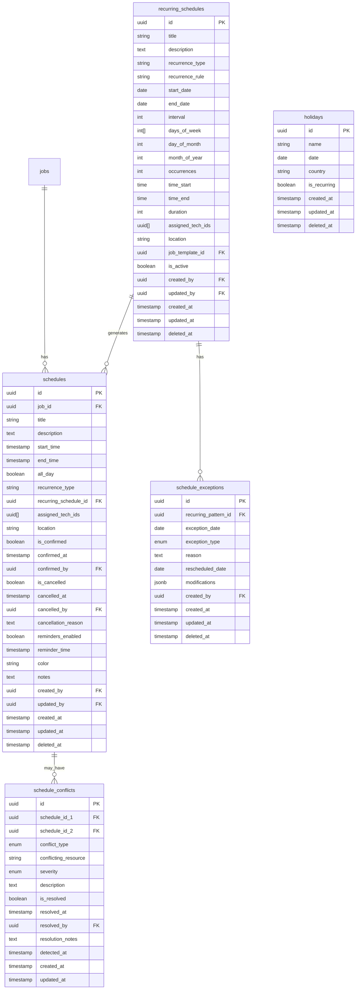

# ServicePro Database Architecture

> **Version**: 1.0
> **Last Updated**: January 2026
> **Database**: PostgreSQL 16

## Table of Contents

1. [Overview](#1-overview)
2. [Schema Diagram](#2-schema-diagram)
3. [Core Tables](#3-core-tables)
4. [Domain Tables](#4-domain-tables)
5. [Supporting Tables](#5-supporting-tables)
6. [Views and Functions](#6-views-and-functions)
7. [Indexes](#7-indexes)
8. [Partitioning](#8-partitioning)
9. [Data Integrity](#9-data-integrity)
10. [Performance Considerations](#10-performance-considerations)

---

## 1. Overview

### 1.1 Database Statistics

| Metric              | Value            |
| ------------------- | ---------------- |
| Total Tables        | 45+              |
| Total Views         | 15+              |
| Total Functions     | 20+              |
| Estimated Data Size | Varies by tenant |

### 1.2 Naming Conventions

| Element      | Convention                 | Example                        |
| ------------ | -------------------------- | ------------------------------ |
| Tables       | snake_case, plural         | `customers`, `job_assignments` |
| Columns      | snake_case                 | `first_name`, `created_at`     |
| Primary Keys | `id` (UUID)                | `id UUID PRIMARY KEY`          |
| Foreign Keys | `{table}_id`               | `customer_id`, `job_id`        |
| Indexes      | `idx_{table}_{columns}`    | `idx_customers_email`          |
| Constraints  | `{table}_{type}_{columns}` | `customers_email_unique`       |

### 1.3 Common Patterns

All tables include:

- `id` - UUID primary key (auto-generated)
- `created_at` - Timestamp of creation
- `updated_at` - Timestamp of last update
- `deleted_at` - Soft delete timestamp (nullable)

---

## 2. Schema Diagram

### 2.1 High-Level Domain Model



### 2.2 User Management Schema



### 2.3 Customer and Job Schema



### 2.4 Quote and Invoice Schema



### 2.5 Payment Schema



### 2.6 Scheduling Schema



---

## 3. Core Tables

### 3.1 Users Table

```sql
CREATE TABLE users (
    id              UUID PRIMARY KEY DEFAULT gen_random_uuid(),
    email           VARCHAR(255) NOT NULL UNIQUE,
    password_hash   VARCHAR(255) NOT NULL,
    role            VARCHAR(50) NOT NULL DEFAULT 'user',
    failed_login_count INTEGER DEFAULT 0,
    last_failed_login_at TIMESTAMP,
    locked_until    TIMESTAMP,
    email_verified  BOOLEAN DEFAULT FALSE,
    verification_sent_at TIMESTAMP,
    created_at      TIMESTAMP DEFAULT CURRENT_TIMESTAMP,
    updated_at      TIMESTAMP DEFAULT CURRENT_TIMESTAMP,
    deleted_at      TIMESTAMP
);

-- Indexes
CREATE INDEX idx_users_email ON users(email) WHERE deleted_at IS NULL;
CREATE INDEX idx_users_locked_until ON users(locked_until) WHERE locked_until IS NOT NULL;
CREATE INDEX idx_users_role ON users(role) WHERE deleted_at IS NULL;
```

### 3.2 Customers Table

```sql
CREATE TABLE customers (
    id              UUID PRIMARY KEY DEFAULT gen_random_uuid(),
    first_name      VARCHAR(100) NOT NULL,
    last_name       VARCHAR(100) NOT NULL,
    company_name    VARCHAR(200),
    email           VARCHAR(255) UNIQUE,
    phone_primary   VARCHAR(20),
    phone_secondary VARCHAR(20),
    billing_street  VARCHAR(255),
    billing_city    VARCHAR(100),
    billing_state   CHAR(2),
    billing_zip     VARCHAR(10),
    service_street  VARCHAR(255),
    service_city    VARCHAR(100),
    service_state   CHAR(2),
    service_zip     VARCHAR(10),
    customer_type   customer_type NOT NULL DEFAULT 'residential',
    status          customer_status NOT NULL DEFAULT 'active',
    notes           TEXT,
    created_at      TIMESTAMP DEFAULT CURRENT_TIMESTAMP,
    updated_at      TIMESTAMP DEFAULT CURRENT_TIMESTAMP,
    deleted_at      TIMESTAMP
);

-- Full-text search
CREATE INDEX idx_customers_fulltext ON customers
    USING gin(to_tsvector('english',
        coalesce(first_name, '') || ' ' ||
        coalesce(last_name, '') || ' ' ||
        coalesce(company_name, '')));
```

---

## 4. Domain Tables

### 4.1 Jobs Table

```sql
CREATE TABLE jobs (
    id                  UUID PRIMARY KEY DEFAULT gen_random_uuid(),
    job_number          VARCHAR(20) UNIQUE NOT NULL,
    customer_id         UUID NOT NULL REFERENCES customers(id),
    title               VARCHAR(255) NOT NULL,
    description         TEXT,
    job_type            job_type NOT NULL DEFAULT 'maintenance',
    status              job_status NOT NULL DEFAULT 'scheduled',
    priority            job_priority NOT NULL DEFAULT 'normal',
    scheduled_start_at  TIMESTAMP,
    scheduled_end_at    TIMESTAMP,
    actual_start_at     TIMESTAMP,
    actual_end_at       TIMESTAMP,
    estimated_duration  INTEGER, -- minutes
    actual_duration     INTEGER GENERATED ALWAYS AS (
        EXTRACT(EPOCH FROM (actual_end_at - actual_start_at)) / 60
    ) STORED,
    service_street      VARCHAR(255),
    service_city        VARCHAR(100),
    service_state       CHAR(2),
    service_zip         VARCHAR(10),
    estimated_cost      DECIMAL(10,2) DEFAULT 0,
    actual_cost         DECIMAL(10,2) DEFAULT 0,
    tax_amount          DECIMAL(10,2) DEFAULT 0,
    total_amount        DECIMAL(10,2) GENERATED ALWAYS AS (
        actual_cost + tax_amount
    ) STORED,
    internal_notes      TEXT,
    customer_notes      TEXT,
    completion_notes    TEXT,
    requires_follow_up  BOOLEAN DEFAULT FALSE,
    follow_up_date      DATE,
    created_by          UUID REFERENCES users(id),
    updated_by          UUID REFERENCES users(id),
    created_at          TIMESTAMP DEFAULT CURRENT_TIMESTAMP,
    updated_at          TIMESTAMP DEFAULT CURRENT_TIMESTAMP,
    deleted_at          TIMESTAMP
);

-- Job number generation trigger
CREATE OR REPLACE FUNCTION generate_job_number()
RETURNS TRIGGER AS $$
BEGIN
    NEW.job_number := 'JOB-' || TO_CHAR(CURRENT_DATE, 'YYYYMMDD') || '-' ||
        LPAD(CAST((SELECT COALESCE(MAX(
            CAST(SUBSTRING(job_number FROM 14) AS INTEGER)
        ), 0) + 1 FROM jobs
        WHERE job_number LIKE 'JOB-' || TO_CHAR(CURRENT_DATE, 'YYYYMMDD') || '-%'
        ) AS VARCHAR), 4, '0');
    RETURN NEW;
END;
$$ LANGUAGE plpgsql;

CREATE TRIGGER set_job_number
    BEFORE INSERT ON jobs
    FOR EACH ROW
    WHEN (NEW.job_number IS NULL)
    EXECUTE FUNCTION generate_job_number();
```

### 4.2 Invoices Table

```sql
CREATE TABLE invoices (
    id                  UUID PRIMARY KEY DEFAULT gen_random_uuid(),
    invoice_number      VARCHAR(20) UNIQUE NOT NULL,
    customer_id         UUID NOT NULL REFERENCES customers(id),
    job_id              UUID REFERENCES jobs(id),
    quote_id            UUID REFERENCES quotes(id),
    status              invoice_status NOT NULL DEFAULT 'draft',
    issue_date          DATE NOT NULL DEFAULT CURRENT_DATE,
    due_date            DATE NOT NULL,
    sent_date           TIMESTAMP,
    viewed_date         TIMESTAMP,
    paid_date           TIMESTAMP,
    subtotal            DECIMAL(10,2) NOT NULL DEFAULT 0,
    tax_amount          DECIMAL(10,2) NOT NULL DEFAULT 0,
    discount_amount     DECIMAL(10,2) NOT NULL DEFAULT 0,
    total_amount        DECIMAL(10,2) NOT NULL DEFAULT 0,
    amount_paid         DECIMAL(10,2) NOT NULL DEFAULT 0,
    amount_due          DECIMAL(10,2) GENERATED ALWAYS AS (
        total_amount - amount_paid
    ) STORED,
    payment_term_id     UUID REFERENCES payment_terms(id),
    tax_rate_id         UUID REFERENCES tax_rates(id),
    po_number           VARCHAR(50),
    notes               TEXT,
    terms_and_conditions TEXT,
    footer_text         TEXT,
    created_by          UUID REFERENCES users(id),
    updated_by          UUID REFERENCES users(id),
    created_at          TIMESTAMP DEFAULT CURRENT_TIMESTAMP,
    updated_at          TIMESTAMP DEFAULT CURRENT_TIMESTAMP,
    deleted_at          TIMESTAMP,

    CONSTRAINT valid_due_date CHECK (due_date >= issue_date),
    CONSTRAINT valid_amounts CHECK (
        subtotal >= 0 AND
        tax_amount >= 0 AND
        discount_amount >= 0 AND
        total_amount >= 0 AND
        amount_paid >= 0
    )
);

-- Invoice number generation (INV-YYYY-00001)
CREATE OR REPLACE FUNCTION generate_invoice_number()
RETURNS TRIGGER AS $$
BEGIN
    NEW.invoice_number := 'INV-' || TO_CHAR(CURRENT_DATE, 'YYYY') || '-' ||
        LPAD(CAST((SELECT COALESCE(MAX(
            CAST(SUBSTRING(invoice_number FROM 10) AS INTEGER)
        ), 0) + 1 FROM invoices
        WHERE invoice_number LIKE 'INV-' || TO_CHAR(CURRENT_DATE, 'YYYY') || '-%'
        ) AS VARCHAR), 5, '0');
    RETURN NEW;
END;
$$ LANGUAGE plpgsql;
```

---

## 5. Supporting Tables

### 5.1 Enum Types

```sql
-- Customer types
CREATE TYPE customer_type AS ENUM ('residential', 'commercial');
CREATE TYPE customer_status AS ENUM ('active', 'inactive', 'prospect');

-- Job types
CREATE TYPE job_type AS ENUM ('installation', 'maintenance', 'repair', 'inspection', 'emergency');
CREATE TYPE job_status AS ENUM ('scheduled', 'in_progress', 'on_hold', 'completed', 'cancelled');
CREATE TYPE job_priority AS ENUM ('low', 'normal', 'high', 'urgent');

-- Quote and Invoice
CREATE TYPE quote_status AS ENUM ('draft', 'sent', 'accepted', 'rejected', 'expired');
CREATE TYPE invoice_status AS ENUM (
    'draft', 'sent', 'viewed', 'paid', 'partially_paid',
    'overdue', 'cancelled', 'refunded'
);

-- Payment
CREATE TYPE payment_term_type AS ENUM (
    'due_on_receipt', 'net_7', 'net_10', 'net_15',
    'net_30', 'net_60', 'net_90', 'custom'
);
CREATE TYPE tax_type AS ENUM ('sales_tax', 'vat', 'gst', 'hst', 'exempt');

-- Scheduling
CREATE TYPE conflict_type AS ENUM (
    'technician_overlap', 'location_overlap',
    'equipment_overlap', 'time_overlap'
);
CREATE TYPE severity_level AS ENUM ('low', 'medium', 'high', 'critical');
CREATE TYPE exception_type AS ENUM ('skip', 'reschedule', 'modify');

-- Notifications
CREATE TYPE notification_type AS ENUM (
    'payment_due_soon', 'payment_overdue', 'payment_in_grace_period',
    'early_payment_discount_available', 'late_fee_applied',
    'payment_received', 'partial_payment_received'
);
CREATE TYPE notification_status AS ENUM ('pending', 'sent', 'failed', 'dismissed');
CREATE TYPE notification_channel AS ENUM ('email', 'sms', 'push', 'in_app', 'webhook');
```

### 5.2 Audit Log Tables

```sql
CREATE TABLE invoice_audit_log (
    id              UUID PRIMARY KEY DEFAULT gen_random_uuid(),
    invoice_id      UUID NOT NULL REFERENCES invoices(id) ON DELETE CASCADE,
    action          VARCHAR(50) NOT NULL, -- 'created', 'updated', 'status_changed', etc.
    field_name      VARCHAR(100),
    old_value       TEXT,
    new_value       TEXT,
    from_status     invoice_status,
    to_status       invoice_status,
    changed_by      UUID REFERENCES users(id),
    changed_by_type VARCHAR(20), -- 'user', 'system', 'webhook'
    ip_address      INET,
    user_agent      TEXT,
    created_at      TIMESTAMP DEFAULT CURRENT_TIMESTAMP
);

CREATE INDEX idx_invoice_audit_invoice_id ON invoice_audit_log(invoice_id);
CREATE INDEX idx_invoice_audit_created_at ON invoice_audit_log(created_at);
```

---

## 6. Views and Functions

### 6.1 Materialized Views

```sql
-- Revenue summary by month
CREATE MATERIALIZED VIEW revenue_by_month AS
SELECT
    DATE_TRUNC('month', i.paid_date) AS month,
    COUNT(*) AS invoice_count,
    SUM(i.total_amount) AS total_revenue,
    SUM(i.tax_amount) AS total_tax,
    AVG(i.total_amount) AS avg_invoice_value
FROM invoices i
WHERE i.status = 'paid' AND i.deleted_at IS NULL
GROUP BY DATE_TRUNC('month', i.paid_date)
ORDER BY month DESC;

-- Refresh schedule
CREATE INDEX idx_revenue_by_month ON revenue_by_month(month);

-- Job statistics view
CREATE VIEW job_statistics AS
SELECT
    status,
    priority,
    job_type,
    COUNT(*) AS count,
    AVG(actual_duration) AS avg_duration,
    SUM(actual_cost) AS total_cost
FROM jobs
WHERE deleted_at IS NULL
GROUP BY status, priority, job_type;

-- Technician workload view
CREATE VIEW technician_workload AS
SELECT
    u.id AS technician_id,
    u.email,
    COUNT(ja.id) AS assigned_jobs,
    SUM(ja.hours_worked) AS total_hours,
    COUNT(CASE WHEN j.status = 'in_progress' THEN 1 END) AS active_jobs,
    COUNT(CASE WHEN j.status = 'completed' THEN 1 END) AS completed_jobs
FROM users u
LEFT JOIN job_assignments ja ON ja.user_id = u.id AND ja.deleted_at IS NULL
LEFT JOIN jobs j ON j.id = ja.job_id AND j.deleted_at IS NULL
WHERE u.role IN ('technician', 'user')
GROUP BY u.id, u.email;
```

### 6.2 Utility Functions

```sql
-- Calculate invoice totals from line items
CREATE OR REPLACE FUNCTION calculate_invoice_totals(p_invoice_id UUID)
RETURNS VOID AS $$
BEGIN
    UPDATE invoices i
    SET
        subtotal = (
            SELECT COALESCE(SUM(line_total), 0)
            FROM invoice_lines
            WHERE invoice_id = p_invoice_id
        ),
        tax_amount = (
            SELECT COALESCE(SUM(tax_amount), 0)
            FROM invoice_lines
            WHERE invoice_id = p_invoice_id AND taxable = TRUE
        ),
        total_amount = subtotal + tax_amount - discount_amount,
        updated_at = CURRENT_TIMESTAMP
    WHERE id = p_invoice_id;
END;
$$ LANGUAGE plpgsql;

-- Check for schedule conflicts
CREATE OR REPLACE FUNCTION check_schedule_conflict(
    p_schedule_id UUID,
    p_start_time TIMESTAMP,
    p_end_time TIMESTAMP,
    p_tech_ids UUID[]
)
RETURNS TABLE(conflict_id UUID, conflict_type conflict_type) AS $$
BEGIN
    RETURN QUERY
    SELECT
        s.id,
        'technician_overlap'::conflict_type
    FROM schedules s
    WHERE s.id != p_schedule_id
      AND s.deleted_at IS NULL
      AND s.is_cancelled = FALSE
      AND s.assigned_tech_ids && p_tech_ids
      AND (p_start_time, p_end_time) OVERLAPS (s.start_time, s.end_time);
END;
$$ LANGUAGE plpgsql;

-- Auto-expire quotes
CREATE OR REPLACE FUNCTION expire_old_quotes()
RETURNS INTEGER AS $$
DECLARE
    expired_count INTEGER;
BEGIN
    UPDATE quotes
    SET status = 'expired', updated_at = CURRENT_TIMESTAMP
    WHERE status IN ('draft', 'sent')
      AND valid_until < CURRENT_DATE
      AND deleted_at IS NULL;

    GET DIAGNOSTICS expired_count = ROW_COUNT;
    RETURN expired_count;
END;
$$ LANGUAGE plpgsql;
```

---

## 7. Indexes

### 7.1 Index Strategy

| Index Type       | Use Case                 | Example                         |
| ---------------- | ------------------------ | ------------------------------- |
| B-tree (default) | Equality, range queries  | `WHERE status = 'active'`       |
| GIN              | Full-text search, arrays | `WHERE tags @> ARRAY['urgent']` |
| GiST             | Geometric, ranges        | `WHERE tsrange OVERLAPS`        |
| Partial          | Filtered queries         | `WHERE deleted_at IS NULL`      |
| Covering         | Index-only scans         | `INCLUDE (name, email)`         |

### 7.2 Key Indexes

```sql
-- Customers
CREATE INDEX idx_customers_email ON customers(email) WHERE deleted_at IS NULL;
CREATE INDEX idx_customers_status_type ON customers(status, customer_type) WHERE deleted_at IS NULL;
CREATE INDEX idx_customers_fulltext ON customers USING gin(
    to_tsvector('english', coalesce(first_name,'') || ' ' || coalesce(last_name,''))
);

-- Jobs
CREATE INDEX idx_jobs_customer ON jobs(customer_id) WHERE deleted_at IS NULL;
CREATE INDEX idx_jobs_status ON jobs(status) WHERE deleted_at IS NULL;
CREATE INDEX idx_jobs_scheduled ON jobs(scheduled_start_at, scheduled_end_at)
    WHERE deleted_at IS NULL AND status = 'scheduled';
CREATE INDEX idx_jobs_status_priority ON jobs(status, priority) WHERE deleted_at IS NULL;

-- Invoices
CREATE INDEX idx_invoices_customer ON invoices(customer_id) WHERE deleted_at IS NULL;
CREATE INDEX idx_invoices_status ON invoices(status) WHERE deleted_at IS NULL;
CREATE INDEX idx_invoices_due_date ON invoices(due_date)
    WHERE deleted_at IS NULL AND status IN ('sent', 'viewed');
CREATE INDEX idx_invoices_overdue ON invoices(due_date)
    WHERE deleted_at IS NULL AND status = 'overdue';

-- Schedules
CREATE INDEX idx_schedules_time_range ON schedules USING gist(
    tsrange(start_time, end_time)
) WHERE deleted_at IS NULL AND is_cancelled = FALSE;
CREATE INDEX idx_schedules_techs ON schedules USING gin(assigned_tech_ids)
    WHERE deleted_at IS NULL;

-- Payments
CREATE INDEX idx_payments_invoice ON payments(invoice_id);
CREATE INDEX idx_payments_status ON payments(status);
CREATE INDEX idx_payments_stripe ON payments(stripe_payment_intent_id);
```

---

## 8. Partitioning

### 8.1 Time-Based Partitioning

For high-volume tables, we use range partitioning by date:

```sql
-- Revenue transactions (partitioned by month)
CREATE TABLE revenue_transactions (
    id              UUID NOT NULL DEFAULT gen_random_uuid(),
    transaction_date DATE NOT NULL,
    payment_id      UUID,
    user_id         UUID,
    invoice_id      UUID,
    transaction_type VARCHAR(20) NOT NULL,
    gross_amount    DECIMAL(12,2) NOT NULL,
    net_amount      DECIMAL(12,2) NOT NULL,
    created_at      TIMESTAMP DEFAULT CURRENT_TIMESTAMP,
    PRIMARY KEY (id, transaction_date)
) PARTITION BY RANGE (transaction_date);

-- Create monthly partitions
CREATE TABLE revenue_transactions_2025_01
    PARTITION OF revenue_transactions
    FOR VALUES FROM ('2025-01-01') TO ('2025-02-01');

CREATE TABLE revenue_transactions_2025_02
    PARTITION OF revenue_transactions
    FOR VALUES FROM ('2025-02-01') TO ('2025-03-01');

-- Auto-create partitions function
CREATE OR REPLACE FUNCTION create_revenue_partition(p_date DATE)
RETURNS VOID AS $$
DECLARE
    partition_name TEXT;
    start_date DATE;
    end_date DATE;
BEGIN
    start_date := DATE_TRUNC('month', p_date);
    end_date := start_date + INTERVAL '1 month';
    partition_name := 'revenue_transactions_' || TO_CHAR(p_date, 'YYYY_MM');

    EXECUTE format(
        'CREATE TABLE IF NOT EXISTS %I PARTITION OF revenue_transactions
         FOR VALUES FROM (%L) TO (%L)',
        partition_name, start_date, end_date
    );
END;
$$ LANGUAGE plpgsql;
```

### 8.2 Partition Maintenance

```sql
-- Drop old partitions (data retention)
CREATE OR REPLACE FUNCTION drop_old_partitions(
    retention_months INTEGER DEFAULT 24
)
RETURNS INTEGER AS $$
DECLARE
    partition_record RECORD;
    dropped_count INTEGER := 0;
    cutoff_date DATE;
BEGIN
    cutoff_date := DATE_TRUNC('month', CURRENT_DATE - (retention_months || ' months')::INTERVAL);

    FOR partition_record IN
        SELECT tablename
        FROM pg_tables
        WHERE tablename LIKE 'revenue_transactions_____'
          AND TO_DATE(SUBSTRING(tablename FROM 23), 'YYYY_MM') < cutoff_date
    LOOP
        EXECUTE 'DROP TABLE IF EXISTS ' || partition_record.tablename;
        dropped_count := dropped_count + 1;
    END LOOP;

    RETURN dropped_count;
END;
$$ LANGUAGE plpgsql;
```

---

## 9. Data Integrity

### 9.1 Foreign Key Constraints

```sql
-- Cascade on delete (for child records)
ALTER TABLE invoice_lines
    ADD CONSTRAINT fk_invoice_lines_invoice
    FOREIGN KEY (invoice_id) REFERENCES invoices(id) ON DELETE CASCADE;

-- Restrict on delete (for important references)
ALTER TABLE jobs
    ADD CONSTRAINT fk_jobs_customer
    FOREIGN KEY (customer_id) REFERENCES customers(id) ON DELETE RESTRICT;

-- Set null on delete (for optional references)
ALTER TABLE invoices
    ADD CONSTRAINT fk_invoices_job
    FOREIGN KEY (job_id) REFERENCES jobs(id) ON DELETE SET NULL;
```

### 9.2 Check Constraints

```sql
-- Valid email format
ALTER TABLE users ADD CONSTRAINT valid_email
    CHECK (email ~* '^[A-Za-z0-9._%+-]+@[A-Za-z0-9.-]+\.[A-Za-z]{2,}$');

-- Valid phone format
ALTER TABLE customers ADD CONSTRAINT valid_phone
    CHECK (phone_primary IS NULL OR phone_primary ~ '^\+?[0-9]{10,15}$');

-- Valid state code
ALTER TABLE customers ADD CONSTRAINT valid_state
    CHECK (billing_state IS NULL OR billing_state ~ '^[A-Z]{2}$');

-- Valid amounts
ALTER TABLE invoices ADD CONSTRAINT valid_invoice_amounts
    CHECK (
        subtotal >= 0 AND
        tax_amount >= 0 AND
        discount_amount >= 0 AND
        total_amount >= 0 AND
        amount_paid >= 0 AND
        amount_paid <= total_amount
    );

-- Valid date ranges
ALTER TABLE jobs ADD CONSTRAINT valid_schedule
    CHECK (scheduled_end_at IS NULL OR scheduled_end_at > scheduled_start_at);
```

### 9.3 Triggers for Data Integrity

```sql
-- Auto-update updated_at
CREATE OR REPLACE FUNCTION update_updated_at()
RETURNS TRIGGER AS $$
BEGIN
    NEW.updated_at = CURRENT_TIMESTAMP;
    RETURN NEW;
END;
$$ LANGUAGE plpgsql;

CREATE TRIGGER update_customers_updated_at
    BEFORE UPDATE ON customers
    FOR EACH ROW EXECUTE FUNCTION update_updated_at();

-- Prevent invalid status transitions
CREATE OR REPLACE FUNCTION validate_job_status_transition()
RETURNS TRIGGER AS $$
BEGIN
    -- Define valid transitions
    IF OLD.status = 'completed' AND NEW.status != 'completed' THEN
        RAISE EXCEPTION 'Cannot change status of completed job';
    END IF;

    IF OLD.status = 'cancelled' AND NEW.status != 'cancelled' THEN
        RAISE EXCEPTION 'Cannot change status of cancelled job';
    END IF;

    RETURN NEW;
END;
$$ LANGUAGE plpgsql;

CREATE TRIGGER validate_job_status
    BEFORE UPDATE OF status ON jobs
    FOR EACH ROW EXECUTE FUNCTION validate_job_status_transition();
```

---

## 10. Performance Considerations

### 10.1 Query Optimization

```sql
-- Use EXPLAIN ANALYZE for query planning
EXPLAIN (ANALYZE, BUFFERS, FORMAT TEXT)
SELECT c.*, COUNT(j.id) AS job_count
FROM customers c
LEFT JOIN jobs j ON j.customer_id = c.id AND j.deleted_at IS NULL
WHERE c.deleted_at IS NULL AND c.status = 'active'
GROUP BY c.id
ORDER BY job_count DESC
LIMIT 10;

-- Optimize with covering indexes
CREATE INDEX idx_jobs_customer_covering
ON jobs(customer_id)
INCLUDE (status, scheduled_start_at)
WHERE deleted_at IS NULL;
```

### 10.2 Connection Pooling

```yaml
# PgBouncer configuration
[pgbouncer]
pool_mode = transaction
max_client_conn = 1000
default_pool_size = 25
min_pool_size = 5
reserve_pool_size = 5
reserve_pool_timeout = 3
```

### 10.3 Maintenance Tasks

```sql
-- Regular maintenance schedule
-- Run VACUUM ANALYZE nightly
VACUUM ANALYZE customers;
VACUUM ANALYZE jobs;
VACUUM ANALYZE invoices;

-- Refresh materialized views
REFRESH MATERIALIZED VIEW CONCURRENTLY revenue_by_month;

-- Reindex periodically (weekly)
REINDEX TABLE CONCURRENTLY customers;
REINDEX TABLE CONCURRENTLY jobs;
```

### 10.4 Monitoring Queries

```sql
-- Slow query log
ALTER SYSTEM SET log_min_duration_statement = '1000'; -- Log queries > 1s

-- Table sizes
SELECT
    schemaname,
    tablename,
    pg_size_pretty(pg_total_relation_size(schemaname||'.'||tablename)) AS total_size,
    pg_size_pretty(pg_relation_size(schemaname||'.'||tablename)) AS table_size,
    pg_size_pretty(pg_indexes_size(schemaname||'.'||tablename)) AS index_size
FROM pg_tables
WHERE schemaname = 'public'
ORDER BY pg_total_relation_size(schemaname||'.'||tablename) DESC;

-- Index usage
SELECT
    schemaname,
    tablename,
    indexname,
    idx_scan,
    idx_tup_read,
    idx_tup_fetch
FROM pg_stat_user_indexes
ORDER BY idx_scan DESC;

-- Unused indexes (candidates for removal)
SELECT
    schemaname,
    tablename,
    indexname,
    pg_size_pretty(pg_relation_size(indexrelid)) AS size
FROM pg_stat_user_indexes
WHERE idx_scan = 0 AND indexrelid::regclass::text NOT LIKE '%_pkey';
```

---

## Document History

| Version | Date    | Author           | Changes               |
| ------- | ------- | ---------------- | --------------------- |
| 1.0     | 2026-01 | Engineering Team | Initial documentation |

---

_This document should be reviewed and updated when schema changes occur._
