# ServicePro Security Architecture

> **Classification**: Internal
> **Version**: 1.0
> **Last Updated**: January 2026

## Table of Contents

1. [Security Overview](#1-security-overview)
2. [Authentication](#2-authentication)
3. [Authorization](#3-authorization)
4. [Data Protection](#4-data-protection)
5. [Network Security](#5-network-security)
6. [Application Security](#6-application-security)
7. [Infrastructure Security](#7-infrastructure-security)
8. [Compliance](#8-compliance)
9. [Security Monitoring](#9-security-monitoring)
10. [Incident Response](#10-incident-response)

---

## 1. Security Overview

### 1.1 Security Principles

ServicePro follows defense-in-depth security principles:

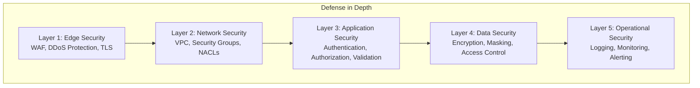

### 1.2 Security Domains

| Domain                      | Responsibility             | Key Controls                |
| --------------------------- | -------------------------- | --------------------------- |
| **Identity & Access**       | Who can access what        | JWT, RBAC, MFA              |
| **Data Protection**         | Protecting sensitive data  | Encryption, Masking, Backup |
| **Network Security**        | Secure communications      | TLS, VPC, Firewalls         |
| **Application Security**    | Secure code practices      | Input validation, OWASP     |
| **Infrastructure Security** | Secure hosting environment | AWS security, Patching      |
| **Operations Security**     | Secure operations          | Logging, Monitoring, IR     |

---

## 2. Authentication

### 2.1 Authentication Architecture

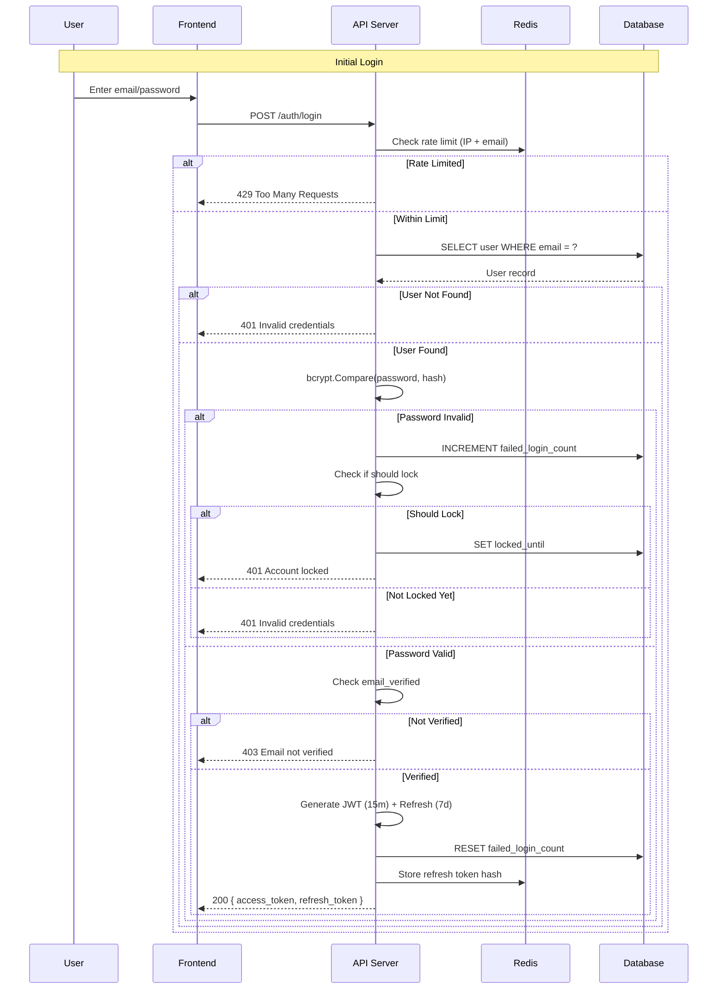

### 2.2 JWT Token Structure

```
Header:
{
  "alg": "HS256",
  "typ": "JWT"
}

Payload:
{
  "sub": "user-uuid",           // Subject (user ID)
  "email": "user@example.com",  // User email
  "role": "manager",            // Primary role
  "iat": 1700000000,            // Issued at
  "exp": 1700000900,            // Expires (15 minutes)
  "iss": "servicepro",          // Issuer
  "jti": "unique-token-id"      // Token ID for revocation
}

Signature:
HMACSHA256(
  base64UrlEncode(header) + "." + base64UrlEncode(payload),
  JWT_SECRET
)
```

### 2.3 Token Lifecycle

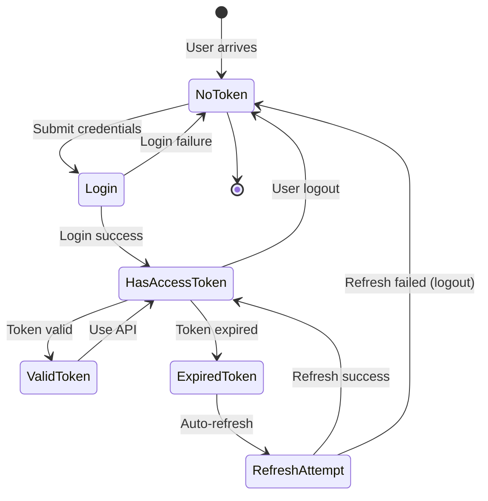

### 2.4 Password Security

| Control               | Implementation                             |
| --------------------- | ------------------------------------------ |
| **Hashing Algorithm** | bcrypt with cost factor 12                 |
| **Minimum Length**    | 8 characters                               |
| **Complexity**        | Must contain: uppercase, lowercase, number |
| **History**           | Cannot reuse last 5 passwords              |
| **Expiration**        | Optional, configurable by admin            |
| **Reset**             | Token-based, 1-hour expiry                 |

### 2.5 Account Lockout

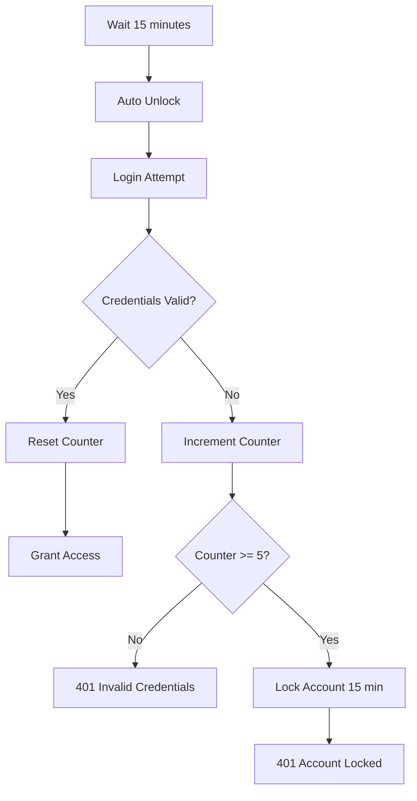

---

## 3. Authorization

### 3.1 Role-Based Access Control (RBAC)

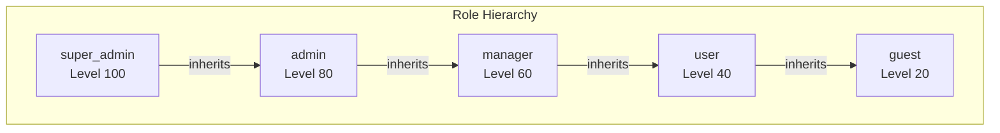

### 3.2 Permission Model

Permissions follow the format: `resource.action`

**Resources:**

- `users` - User accounts
- `roles` - Role definitions
- `permissions` - Permission definitions
- `customers` - Customer records
- `jobs` - Job/work orders
- `quotes` - Quotes
- `invoices` - Invoices
- `payments` - Payments
- `reports` - Analytics reports
- `settings` - System settings

**Actions:**

- `create` - Create new records
- `read` - View records
- `update` - Modify records
- `delete` - Delete records
- `list` - List/search records
- `manage` - Full control
- `assign` - Assign resources
- `approve` - Approve workflows

### 3.3 Default Role Permissions

| Permission       | super_admin | admin | manager | user | guest |
| ---------------- | :---------: | :---: | :-----: | :--: | :---: |
| users.manage     |      ✓      |   ✓   |         |      |       |
| roles.manage     |      ✓      |       |         |      |       |
| customers.create |      ✓      |   ✓   |    ✓    |      |       |
| customers.read   |      ✓      |   ✓   |    ✓    |  ✓   |   ✓   |
| customers.update |      ✓      |   ✓   |    ✓    |      |       |
| customers.delete |      ✓      |   ✓   |         |      |       |
| jobs.create      |      ✓      |   ✓   |    ✓    |      |       |
| jobs.read        |      ✓      |   ✓   |    ✓    |  ✓   |   ✓   |
| jobs.update      |      ✓      |   ✓   |    ✓    |  ✓   |       |
| jobs.delete      |      ✓      |   ✓   |         |      |       |
| invoices.create  |      ✓      |   ✓   |    ✓    |      |       |
| invoices.read    |      ✓      |   ✓   |    ✓    |  ✓   |       |
| invoices.manage  |      ✓      |   ✓   |         |      |       |
| reports.view     |      ✓      |   ✓   |    ✓    |      |       |
| settings.manage  |      ✓      |   ✓   |         |      |       |

### 3.4 Permission Check Flow

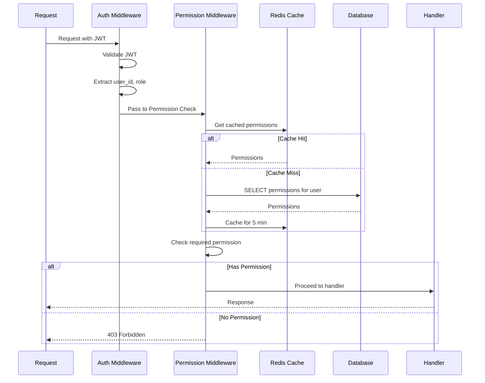

---

## 4. Data Protection

### 4.1 Encryption

#### At Rest

| Data Type  | Encryption       | Key Management |
| ---------- | ---------------- | -------------- |
| Database   | AES-256 (RDS)    | AWS KMS        |
| S3 Objects | AES-256 (SSE-S3) | AWS Managed    |
| Redis      | In-transit only  | N/A            |
| Backups    | AES-256          | AWS KMS        |

#### In Transit

| Connection   | Protocol | Cipher Suites          |
| ------------ | -------- | ---------------------- |
| Client → CDN | TLS 1.3  | ECDHE+AESGCM           |
| CDN → ALB    | TLS 1.2+ | AWS ALB default        |
| ALB → API    | TLS 1.2+ | AWS internal           |
| API → RDS    | TLS 1.2+ | AWS RDS CA             |
| API → Redis  | TLS 1.2+ | ElastiCache encryption |

### 4.2 Sensitive Data Handling

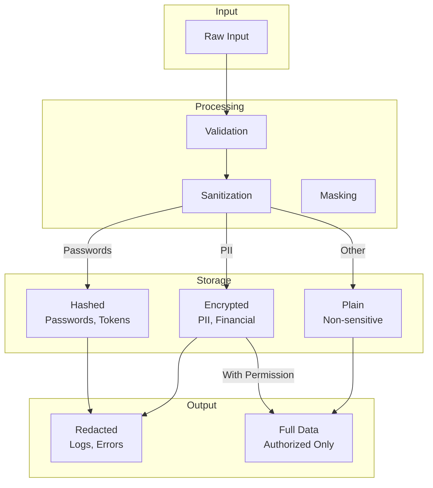

### 4.3 PII Data Classification

| Classification         | Examples              | Controls                                |
| ---------------------- | --------------------- | --------------------------------------- |
| **High Sensitivity**   | SSN, Payment Cards    | Encrypted, Limited access, Audit logged |
| **Medium Sensitivity** | Email, Phone, Address | Encrypted at rest, Role-based access    |
| **Low Sensitivity**    | Names, Company        | Standard protection                     |
| **Public**             | Invoice numbers       | No special protection                   |

### 4.4 Data Retention

| Data Type     | Retention                   | Deletion Method            |
| ------------- | --------------------------- | -------------------------- |
| User Accounts | Until deletion requested    | Soft delete + 30-day purge |
| Customers     | 7 years after last activity | Anonymization              |
| Invoices      | 7 years (legal requirement) | Archive to cold storage    |
| Jobs          | 5 years                     | Archive                    |
| Audit Logs    | 2 years                     | Rotate to archive          |
| Session Data  | 24 hours                    | Auto-expire                |

---

## 5. Network Security

### 5.1 Network Architecture

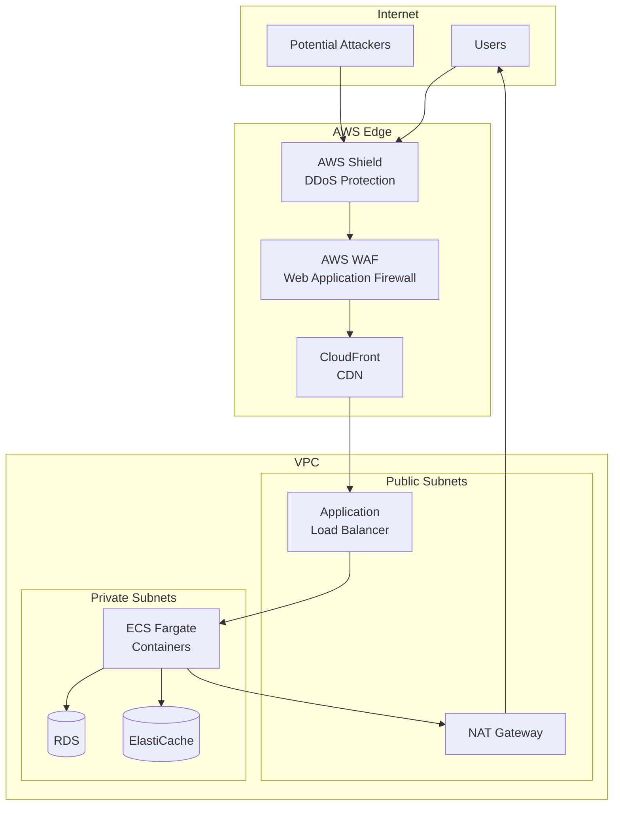

### 5.2 Security Groups

```
SG: ALB (sg-alb)
┌────────────────────────────────────────┐
│ Inbound:                               │
│   - 443/tcp from 0.0.0.0/0 (HTTPS)    │
│ Outbound:                              │
│   - 8080/tcp to sg-api                │
└────────────────────────────────────────┘

SG: API (sg-api)
┌────────────────────────────────────────┐
│ Inbound:                               │
│   - 8080/tcp from sg-alb only         │
│ Outbound:                              │
│   - 5432/tcp to sg-db                 │
│   - 6379/tcp to sg-redis              │
│   - 443/tcp to 0.0.0.0/0 (AWS APIs)   │
└────────────────────────────────────────┘

SG: Database (sg-db)
┌────────────────────────────────────────┐
│ Inbound:                               │
│   - 5432/tcp from sg-api only         │
│ Outbound:                              │
│   - None                               │
└────────────────────────────────────────┘

SG: Redis (sg-redis)
┌────────────────────────────────────────┐
│ Inbound:                               │
│   - 6379/tcp from sg-api only         │
│ Outbound:                              │
│   - None                               │
└────────────────────────────────────────┘
```

### 5.3 WAF Rules

| Rule                                     | Action | Description                                |
| ---------------------------------------- | ------ | ------------------------------------------ |
| AWS-AWSManagedRulesCommonRuleSet         | Block  | Common vulnerabilities                     |
| AWS-AWSManagedRulesSQLiRuleSet           | Block  | SQL injection                              |
| AWS-AWSManagedRulesKnownBadInputsRuleSet | Block  | Known bad patterns                         |
| RateLimit-1000                           | Block  | > 1000 requests/5min per IP                |
| GeoBlock                                 | Block  | Block non-target countries (if applicable) |
| Custom-APIAbuse                          | Block  | Specific API abuse patterns                |

---

## 6. Application Security

### 6.1 OWASP Top 10 Mitigations

| Vulnerability                        | Mitigation                                         |
| ------------------------------------ | -------------------------------------------------- |
| **A01: Broken Access Control**       | RBAC, permission checks on every endpoint          |
| **A02: Cryptographic Failures**      | TLS 1.3, AES-256 encryption, secure key management |
| **A03: Injection**                   | Parameterized queries (GORM), input validation     |
| **A04: Insecure Design**             | Threat modeling, security reviews                  |
| **A05: Security Misconfiguration**   | Infrastructure as code, security scanning          |
| **A06: Vulnerable Components**       | Dependency scanning, auto-updates                  |
| **A07: Authentication Failures**     | JWT, rate limiting, account lockout                |
| **A08: Software Integrity Failures** | Signed artifacts, code review                      |
| **A09: Logging Failures**            | Comprehensive audit logging                        |
| **A10: SSRF**                        | Allowlist external calls, disable redirects        |

### 6.2 Input Validation

```go
// Example: Customer creation validation
type CreateCustomerRequest struct {
    FirstName    string `json:"first_name" validate:"required,min=1,max=100"`
    LastName     string `json:"last_name" validate:"required,min=1,max=100"`
    Email        string `json:"email" validate:"required,email"`
    Phone        string `json:"phone" validate:"omitempty,e164"`
    CustomerType string `json:"customer_type" validate:"required,oneof=residential commercial"`
}

// Validation occurs at:
// 1. JSON binding (type checking)
// 2. Struct validation (business rules)
// 3. Database constraints (uniqueness, foreign keys)
```

### 6.3 Rate Limiting

| Endpoint Category     | Limit        | Window    | Key        |
| --------------------- | ------------ | --------- | ---------- |
| Login                 | 10 requests  | 1 minute  | IP + Email |
| Password Reset        | 5 requests   | 1 minute  | IP + Email |
| API (authenticated)   | 100 requests | 1 minute  | User ID    |
| API (unauthenticated) | 30 requests  | 1 minute  | IP         |
| Invoice PDF           | 10 requests  | 1 minute  | User ID    |
| Export                | 5 requests   | 5 minutes | User ID    |

### 6.4 Security Headers

```
Strict-Transport-Security: max-age=31536000; includeSubDomains; preload
Content-Security-Policy: default-src 'self'; script-src 'self' 'unsafe-inline' https://js.stripe.com
X-Content-Type-Options: nosniff
X-Frame-Options: DENY
X-XSS-Protection: 1; mode=block
Referrer-Policy: strict-origin-when-cross-origin
Permissions-Policy: geolocation=(), microphone=(), camera=()
```

---

## 7. Infrastructure Security

### 7.1 AWS Security Services

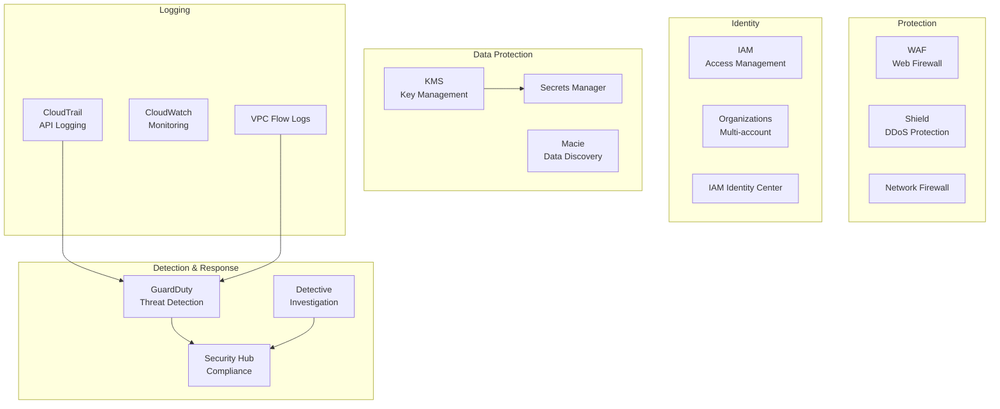

### 7.2 IAM Policies

```json
// ECS Task Role - Minimum Required Permissions
{
  "Version": "2012-10-17",
  "Statement": [
    {
      "Effect": "Allow",
      "Action": ["s3:GetObject", "s3:PutObject", "s3:DeleteObject"],
      "Resource": "arn:aws:s3:::servicepro-uploads/*"
    },
    {
      "Effect": "Allow",
      "Action": ["ses:SendEmail", "ses:SendRawEmail"],
      "Resource": "*",
      "Condition": {
        "StringEquals": {
          "ses:FromAddress": "noreply@servicepro.com"
        }
      }
    },
    {
      "Effect": "Allow",
      "Action": ["secretsmanager:GetSecretValue"],
      "Resource": "arn:aws:secretsmanager:*:*:secret:servicepro/*"
    }
  ]
}
```

### 7.3 Secrets Management

| Secret               | Storage         | Rotation         |
| -------------------- | --------------- | ---------------- |
| Database credentials | Secrets Manager | 90 days (auto)   |
| JWT signing key      | Secrets Manager | Manual           |
| Stripe API keys      | Secrets Manager | Manual           |
| AWS SES credentials  | IAM Role        | N/A (role-based) |
| Redis password       | Secrets Manager | 90 days          |

---

## 8. Compliance

### 8.1 Compliance Framework

| Framework     | Applicability                 | Status         |
| ------------- | ----------------------------- | -------------- |
| SOC 2 Type II | Service organization controls | In progress    |
| GDPR          | EU customer data              | Compliant      |
| PCI DSS       | Payment card handling         | Stripe handles |
| CCPA          | California consumer privacy   | Compliant      |

### 8.2 Data Subject Rights (GDPR/CCPA)

| Right             | Implementation            |
| ----------------- | ------------------------- |
| **Access**        | Export user data via API  |
| **Rectification** | Update profile endpoint   |
| **Erasure**       | Account deletion workflow |
| **Portability**   | JSON/CSV data export      |
| **Restriction**   | Account suspension        |
| **Object**        | Marketing opt-out         |

---

## 9. Security Monitoring

### 9.1 Monitoring Architecture

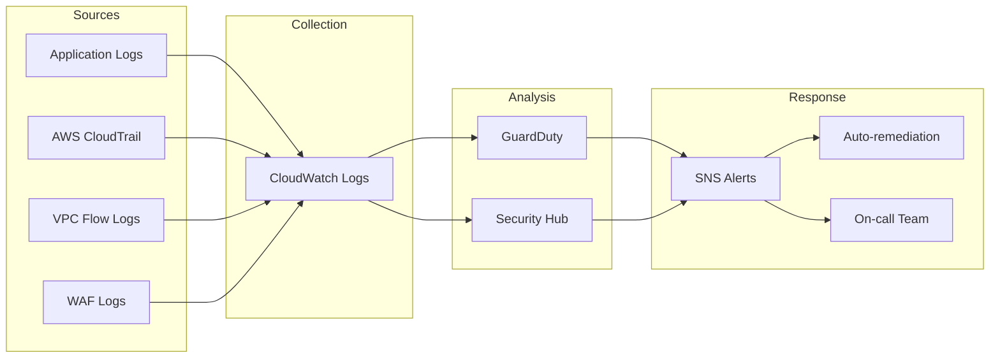

### 9.2 Security Alerts

| Alert                             | Severity | Response                           |
| --------------------------------- | -------- | ---------------------------------- |
| Multiple failed logins            | Medium   | Monitor, potential account lockout |
| Successful login from new country | Low      | Email notification to user         |
| Privilege escalation attempt      | High     | Immediate investigation            |
| SQL injection detected            | High     | Block IP, investigate              |
| Data exfiltration pattern         | Critical | Immediate response                 |
| Unusual API usage pattern         | Medium   | Review and investigate             |

### 9.3 Audit Logging

All security-relevant events are logged:

```json
{
  "timestamp": "2026-01-17T10:30:00Z",
  "event_type": "authentication.login_success",
  "user_id": "uuid",
  "email": "user@example.com",
  "ip_address": "1.2.3.4",
  "user_agent": "Mozilla/5.0...",
  "geo_location": "US",
  "session_id": "session-uuid",
  "request_id": "request-uuid"
}
```

---

## 10. Incident Response

### 10.1 Incident Severity Levels

| Level           | Description                  | Response Time | Examples                           |
| --------------- | ---------------------------- | ------------- | ---------------------------------- |
| **P1 Critical** | Service down or data breach  | 15 minutes    | Data leak, complete outage         |
| **P2 High**     | Major functionality impacted | 1 hour        | Auth system down, payment failures |
| **P3 Medium**   | Minor functionality impacted | 4 hours       | Feature degradation                |
| **P4 Low**      | No user impact               | 24 hours      | Security scan finding              |

### 10.2 Incident Response Process

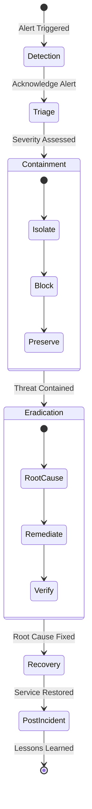

### 10.3 Contact Information

| Role                      | Contact                        | Escalation Path |
| ------------------------- | ------------------------------ | --------------- |
| Security On-Call          | security-oncall@servicepro.com | PagerDuty       |
| Security Lead             | security-lead@servicepro.com   | Direct          |
| Legal (for breaches)      | legal@servicepro.com           | Email           |
| PR (for public incidents) | pr@servicepro.com              | Email           |

---

## Document History

| Version | Date    | Author        | Changes               |
| ------- | ------- | ------------- | --------------------- |
| 1.0     | 2026-01 | Security Team | Initial documentation |

---

_This document is reviewed quarterly and updated as security controls evolve._
